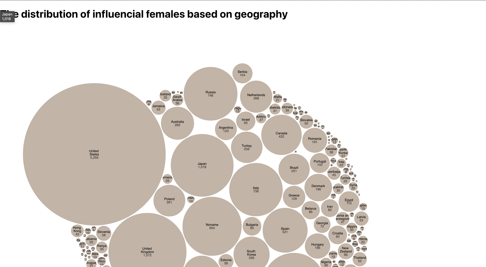

Our project aims to explore the women in the Wikipedia pantheon. We want to know who they are? Why are they on the list? Why are they the only ones on the list?

According to these questions, we generated our first question:
Q1: Who are in the pantheon of Wikipedia? 

To answer this question, we explored the top 200 memorable people on the list. And the result showed that there are only 2 females on the list. This data surprised us and made us think, Why did this happen? Why are there only a few women on this list? 

To answer this question, we generated 3 more questions: 
Q2: What historical reasons impacted women? 
Q3: How do societies affect women?
Q4: What are/were their occupations?

Except for these questions, we will also study the influence of Wikipedia's readers and contributors. We want to acquire some interesting insights from these questions and diagrams. And we hope the data and insights can be inspiring and help people with future designs.

